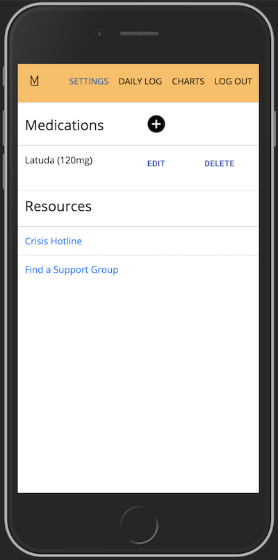
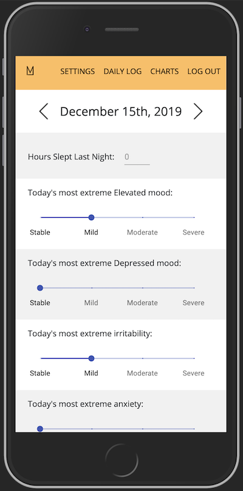
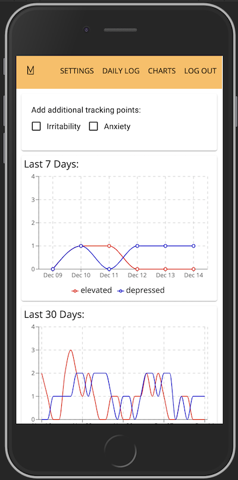

# MoodMap

## Description

There are about 2.3 million people in the US who have been diagnosed with Bipolar Disorder. As with other serious and persistent mental illnesses, Bipolar Disorder requires close tracking of emotions and other lifestyle factors. While there’s no shortage of mood trackers on the market, the majority of them are very broad, only allowing a user to enter one, overarching mood per day. MoodMap is made specifically for people with Bipolar Disorder. Users can keep a daily log to track factors such as elevated and depressed states, irritability, anxiety, and current medications. There is also an Insights section with graphs of data points which empowers users detect any helpful or harmful patterns in behavior.

## Prerequisites
- Node.js

## Screen Shot

## Getting Started
- npm install
- npm run server
- npm run client

## Usage
1. User begins on the Settings page where they see a couple links to mental health resources and a list of current medications. They are able to add, edit, and delete medications.
2. The user can navigate to the Daily Log page where they can fill out their mood tracking points for the day and click submit to save their data. They can also click the arrows to view but not edit previous days' entries.
3. The user can also navigate to the Charts page where they will see two graphs. The first shows the most elevated and the most depressed moods for each day over the last 7 days. The second shows the same tracking points but for the last 30 days. If a user checks either the "Irritability" or "Anxiety" boxes, those tracking points will be added to both graphs.

## Built With
- React | Redux | Redux-Saga
- JavaScript
- Node.js | Express
- Material-UI
- Recharts
- Moment.js

## Acknowledgement
Thank you to Prime Digital Academy for equipping me with the knowledge and tools to create this application.